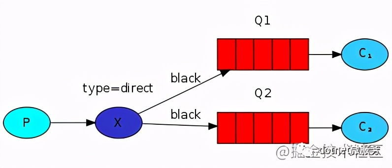
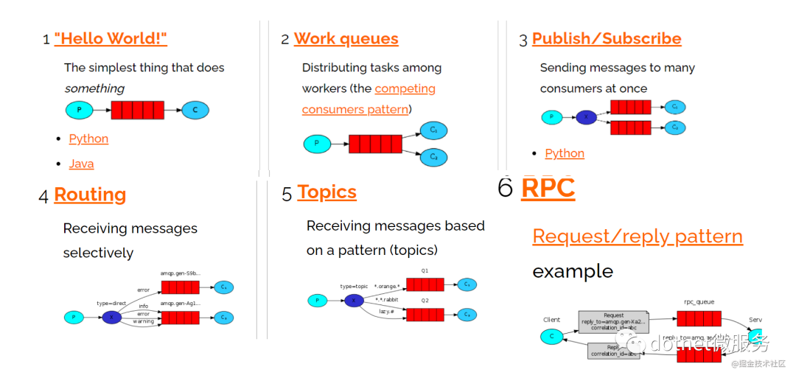
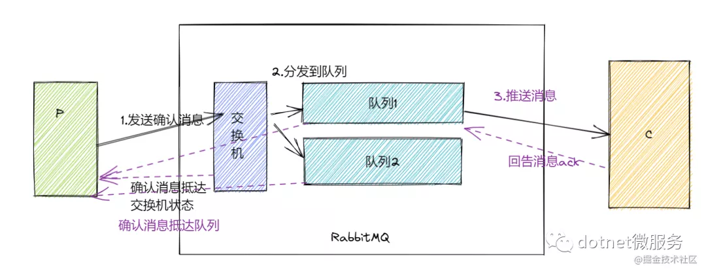

## RabbitMQ

#### 队列模式

##### 1. 简单队列

1个生产者，1个消费者。这种模式下消费者是按照消息的生产顺序严格进行消费的，可以看作是严格顺序消息队列。

##### 2. 工作队列

1个生产者，多个消费者，消费者按照次序逐次把消息排放到各个消费者。因此默认情况下，消费的调度并不是按照工作量来的，而是按照顺序公平调度来的。

##### 3. 发布/订阅模式

也是1个生产者，多个消费者，不过与上面方案不同的是每一个消费者都有自己的一个队列。

生产者将消息直发送到交换机，每个队列都要绑定到交换机。有几种可用的交换类型：**direct**、**topic**、**headers** **和fanout**。我们将关注最后一个——它就是广播(fanout)

因此无论交换机绑定多少队列，交换机总会保证消息被广播给每一个队列。

##### 4. 路由模式

多个消费者，。这里生产者把消息发送到 direct类型的交换机上。该交换机按照绑定的Key路由消息到固定的队列。

##### 5. 主体模式

主题模式相比路由模式，其更灵活，按照订阅的主题建立相关队列，交换机按照主题路由消息到各个队列。

这里一条消息如果负责多个队列的规则，则消息被路由分发到多个队列。当然如果多个规则都匹配一条消息，在一个队列内这条消息也仅被路由1次。

主题可以支持通配符*和#。

##### 6 RPC模式

RPC是远程过程调用。 通过RPC模式，可以利用RabbitMQ构建一个基于RPC通讯的分布式微服务系统。

#### 强一直方案

为了保证消息中间件的强一致性，RabbitMQ提供了集群镜像功能，交换机和队列持久化，以及发布和订阅消息的确认（ack）机制。

#### 来源

https://www.toutiao.com/i6997179248922706463/